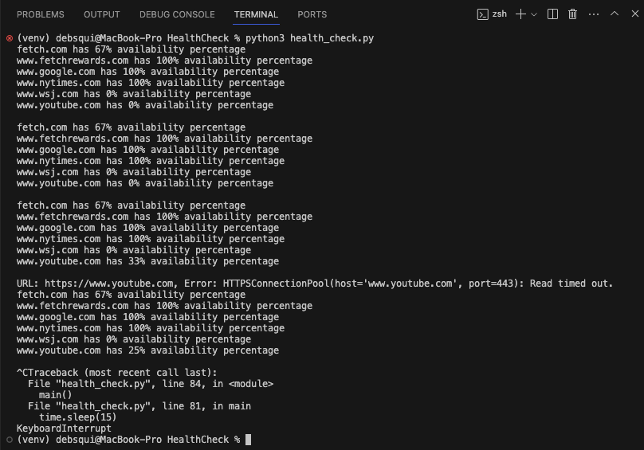

# Introduction
This project is an HTTP Endpoint Health Check Tool designed to monitor the availability of specified web endpoints. The tool can operate in two modes: using simulated responses for testing purposes, or making actual HTTP requests for real-world data.

# Setup Instructions

## Environment Setup
- Ensure Python 3.x is installed on your machine.
- Clone or download the project folder to your local machine.

## Install Dependencies
- Navigate to the project directory in your terminal.
- Create a Python virtual environment:

```zsh
python3 -m venv venv
```
- Activate the virtual environment:
    - On Windows: **venv\Scripts\activate**
    - On Mac/Linux: **source venv/bin/activate**

- Install required packages:

```zsh
pip install -r requirements.txt
```
## Configuration Files

- **endpoints.yaml**: Contains the URLs to check. Modify this file to add or change endpoints.
- **launch.json**: Configuration for running the script in VSCode's debugger.

# Running the Tool

## Choose the Mode

- In **health_check.py**, set **SIMULATED_MODE** to **True** for simulated responses or **False** for actual HTTP requests.

## Execution

- Run the script in VSCode or using the terminal command:

```zsh
python health_check.py
```
- Observe the output in the VSCode debug console or terminal.

# Understanding the Code

## Key Functions

- **Configure logging** 

```python
logging.basicConfig(level=logging.INFO, format='%(message)s', handlers=[logging.StreamHandler()])
```
- **read_yaml(file_path)**: Reads and parses URLs from the YAML file.

```python
def read_yaml(file_path):
    with open(file_path, 'r') as file:
        endpoints = yaml.safe_load(file)
    return [endpoint['url'] for endpoint in endpoints]
```
- **Use of Simulated responses**
    - The simulated responses below are derived from the expected output and the internal program state (Assignment Page 3 & Page 4) that led to the output.

    - When using actual responses from real endpoints by initiating **HTTP requests**, the output of our script will depend on the current status and performance of these endpoints. This means the availability percentages will vary based on the actual **response times** and **status codes** at the time of each request.

    - In a real-world scenario, we won't always have control over these factors, and the outputs will naturally differ from the simulated test cases. This is expected and indicates that our script is responding correctly to the live data it receives.

    - The output in case of **SIMULATED_MODE = TRUE** will always have **0% availability percentage** for google, nytimes, wsj and youtube as they haven't been accounted for in the simulated response section.

```python
# Set this flag to True for simulated responses, False for actual HTTP requests
SIMULATED_MODE = True

simulated_responses = {
    "https://fetch.com/": [(200, 100), (200, 100)],  # UP, UP
    "https://fetch.com/careers": [(200, 600), (200, 300)],  # DOWN, UP
    "https://fetch.com/some/post/endpoint": [(500, 50), (201, 50)],  # DOWN, UP
    "https://www.fetchrewards.com/": [(200, 100), (200, 900)]  # UP, DOWN 
} 

check_counts = {url: 0 for url in simulated_responses}
```

- **check_endpoint(url)**: Checks the health of a given URL. Uses either simulated data or actual HTTP  requests based on **SIMULATED_MODE**.
```python
def check_endpoint(url):
    if SIMULATED_MODE:
        # Logic for simulated responses
        if url in simulated_responses:
            response_index = min(check_counts[url], len(simulated_responses[url]) - 1)
            status_code, latency = simulated_responses[url][response_index]
            check_counts[url] += 1
            return status_code >= 200 and status_code < 300 and latency < 500
        else:
            return False
    else:
        # Logic for actual HTTP requests
        try:
            start_time = time.time()
            response = requests.get(url, timeout=0.5)
            latency = (time.time() - start_time) * 1000  # Convert to milliseconds
            status = response.status_code
            # Below statement to Log actual response data for testing purposes, remove '#' below to activate logging
            #logging.info(f"URL: {url}, Status Code: {status}, Latency: {latency}ms")
            return status >= 200 and status < 300 and latency < 500
        except RequestException as e:
            logging.info(f"URL: {url}, Error: {e}")
            return False
```

- **get_domain(url)**: Extracts the domain from a given URL.
```python
def get_domain(url):
    return urlparse(url).netloc
```
- **main()**: Main function to orchestrate the health checks and log results.

```python
def main():
    yaml_file_path = 'endpoints.yaml'
    endpoints = read_yaml(yaml_file_path)
    domain_status = {get_domain(url): {'up': 0, 'total': 0} for url in endpoints}

    while True:
        domain_check_count = {domain: 0 for domain in domain_status}

        for url in endpoints:
            domain = get_domain(url)
            is_up = check_endpoint(url)
            domain_check_count[domain] += 1
            if is_up:
                domain_status[domain]['up'] += 1
            domain_status[domain]['total'] += 1

        # Log after completing a cycle for all endpoints
        for domain in domain_status:
            if domain_check_count[domain] > 0:
                availability = (domain_status[domain]['up'] / domain_status[domain]['total']) * 100
                logging.info(f"{domain} has {round(availability)}% availability percentage")
        
        # Adding a blank line for readability after each cycle
        logging.info("")

        time.sleep(15)

if __name__ == "__main__":
    main()

```
## Logging and Output

- The tool logs the availability percentage of each domain after each check cycle.
- In simulated mode, predefined responses are used.
- In actual mode, real HTTP requests are made, and results depend on live endpoint statuses.
- Debug Console Output in case of **SIMULATED_MODE = True**


- Terminal Output in case of **SIMULATED_MODE = True**


- Debug Console Output in case of **SIMULATED_MODE = False**


- Terminal Output in case of **SIMULATED_MODE = False**



# Customization and Testing

- Modify **simulated_responses** in **health_check.py** for different testing scenarios.
- Add or remove URLs in **endpoints.yaml** to check different endpoints.
- Use **SIMULATED_MODE** to switch between testing and live monitoring.


# Troubleshooting

- Ensure all dependencies in **requirements.txt** are installed.
- Verify the Python environment is correctly set up and activated.
- Check the format and correctness of URLs in **endpoints.yaml**.
